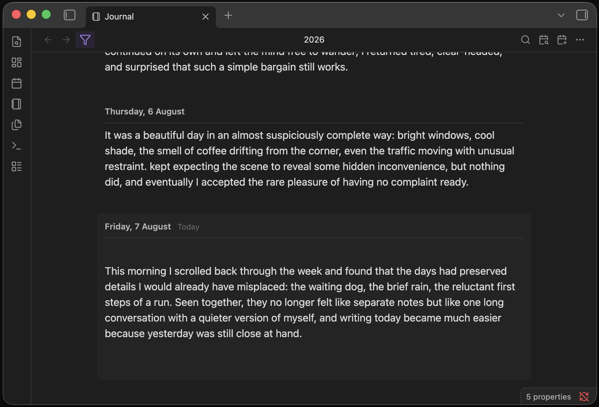

# Journal View

Give your daily notes a sense of continuity. Journal View brings them together in one scrollable,
editable timeline, so revisiting the past and writing today feel like part of the same story.

  

Open Journal View from the sidebar or run **Open journal** from the command palette.

- **Use the daily notes you already have.** Journal View works with your existing notes and daily-note
  settings—no plugin-specific formats, duplicate files, or lock-in.
- **Navigate through time with ease.** Scroll through your journal, jump to any date with the calendar,
  return to today in one click, or open the surrounding days from the notebook button on a daily note.
- **Edit directly in the timeline.** Read and write without switching between files, views, or editing
  modes.
- **Write only when there is something to say.** Start typing on an empty day and Journal View creates
  the daily note only when you need it.
- **Rediscover past entries.** Search across your journal to quickly find notes, ideas, and memories
  from any day.
- **Stay responsive across years of notes.** Journal View keeps the days around you ready to edit
  while efficiently handling the rest of your timeline.

## Settings

Journal View uses your existing daily-note configuration by default. You can override the date
format, folder, and template in **Settings → Journal View** without changing how the rest of your
vault handles daily notes.

| Setting | Default | What it does |
| --- | --- | --- |
| Date format / Folder / Template | Inherited | Overrides your vault's daily-note settings for Journal View |
| Day order | Oldest to newest | Reverses the complete timeline when set to newest to oldest |
| Group days by month | Off | Groups daily entries beneath compact month and year headings |
| Daily header format | `dddd, D MMMM` | Controls how each date appears when month grouping is off |
| Focus today on open | On | Opens the journal at today's note and places the cursor there |
| Only show days that have a note | On | Skips empty days while always keeping today visible; turn it off to show every day |
| Rich editor | On | Uses Obsidian's Markdown editor; turn it off to use the plain-text fallback |
| Autosave delay | 600 ms | Sets how long Journal View waits after typing before saving |

## Privacy

Journal View works locally with files in your Obsidian vault. It does not make network requests,
collect telemetry, require an account, or access files outside your vault.

## License

[MIT](LICENSE) © 2026 RUverse
