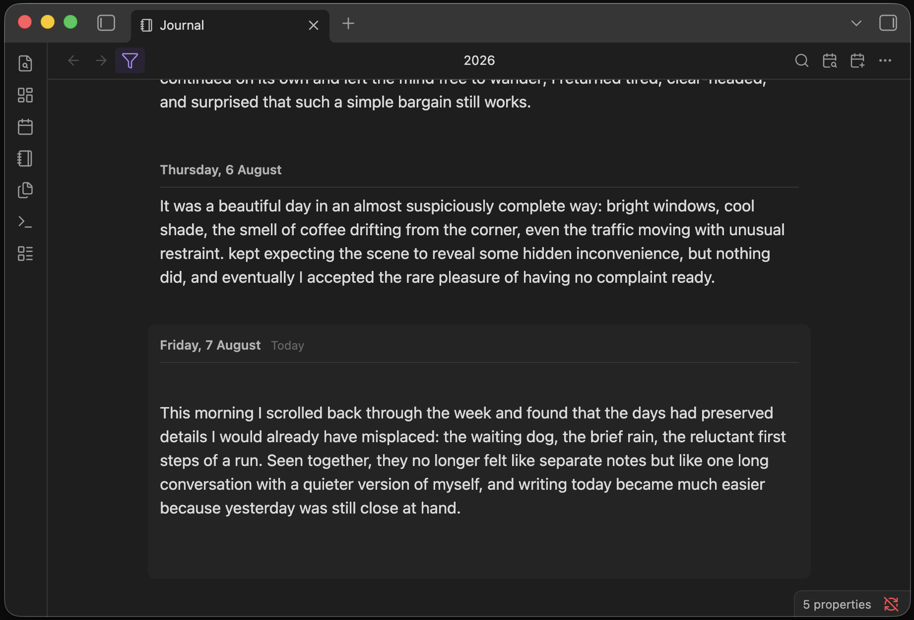

# Journal View

Give your daily notes a sense of continuity. Journal View brings them together in one scrollable,
editable timeline, so revisiting the past and writing today feel like part of the same story.

  

Open Journal View from the sidebar or run **Open journal** from the command palette.

- **Use the daily notes you already have.** Journal View works with your existing notes and daily-note
  settings—no plugin-specific formats, duplicate files, or lock-in.
- **Navigate through time with ease.** Scroll through your journal, jump to any date with the calendar,
  return to today in one click, or open a daily note right where it sits in the journal from the
  notebook button on it.
- **Edit directly in the timeline.** Read and write without switching between files, views, or editing
  modes.
- **Write only when there is something to say.** Start typing on an empty day and Journal View creates
  the daily note only when you need it.
- **Rediscover past entries.** Search across your journal to quickly find notes, ideas, and memories
  from any day.
- **Focus the timeline.** Filter daily notes by tags or exact property values, with include and
  exclude rules that also carry through to calendar navigation and journal search.
- **See what else each day held.** Optionally list the files you created or last edited on each
  day at the bottom of that day, as links that stay out of the way until you open them.
- **Stay responsive across years of notes.** Journal View keeps the days around you ready to edit
  while efficiently handling the rest of your timeline.

## Settings

Journal View uses your existing daily-note configuration by default. You can override the date
format, folder, and template in **Settings → Journal View** without changing how the rest of your
vault handles daily notes.

Some Customization is only visible in the customization menu accessible from the view's toolbar.

| Setting | Default | What it does |
| --- | --- | --- |
| Date format / Folder / Template | Inherited | Overrides your vault's daily-note settings for Journal View |
| Multiple notes per day | Off | Shows notes with more after the date under that day, and adds a button to today that adds another note; see [Several notes a day](#several-notes-a-day) |
| Day order | Oldest to newest | Reverses the complete timeline when set to newest to oldest |
| Daily header format | `dddd, D MMMM` | Controls how each daily header displays its date |
| Daily header style | Subtle | Shows each date subtly, as an H1, or hides the date display |
| Group days by year | On | Marks year boundaries between consecutive visible daily entries |
| Group days by month | Off | Groups daily entries beneath compact month and year headings |
| Year progress | Left | Shows twelve month lines beside the journal that mark the month you are reading, like a scrollbar for the year; select a month to go to its first note. Choose left, right, hidden, or experimental, which puts them on the left with every month named. Appears only when the pane is at least 120 px wider than the journal |
| Focus today on open | On | Opens the journal at today's note and places the cursor there |
| Open journal on startup | Off | Opens or reveals Journal View after Obsidian restores the workspace |
| Only show days that have a note | On | Skips empty days while always keeping today visible; turn it off to show every day |
| Show file modification history | Off | Lists the files created or last edited on each day at the bottom of the day; see [File modification history](#file-modification-history) |
| Rich editor | On | Uses Obsidian's Markdown editor; turn it off to use the plain-text fallback |
| Autosave delay | 2000 ms | Sets how long Journal View waits after typing before saving |
| Days kept loaded | 60 | Sets the target number of days kept in the timeline; dropped days reload when you scroll back to them |

## Several notes a day

A day can hold more than one note in two ways, and Journal View shows all of them under that day:

- **Text after the date.** Turn on **Multiple notes per day** to also include notes whose names go
  on after the date, such as `2026-08-16 Birthday`. The text has to be set off from the date by a
  space or punctuation. Once today has a note, the bottom right of its card has an **Add a note to
  today** button that creates a note named after the date and the current time, such as
  `2026-08-16 14-30`, and puts the cursor in it. A second note in the same minute becomes
  `2026-08-16 14-30-1`, then `-2`, and so on. Select the text after a note's date, in the day's
  header or above the note, to rename the note: `14-30` can become `Lunch`, and links to the note
  follow. Writing in an empty day still creates the plain dated note.
- **A time in the name.** A format that records a time, for example `YYYY-MM-DD HHmm`, keeps a
  separate note for each moment. Writing in an empty day creates a note named after the current time.
  With **Multiple notes per day** on, the add button names its note the same way.

Notes are ordered by their time, then by name, with the plain-date note first. The first note sits
directly under the day's header, which shows its time or the text after its date; each further note
gets a divider with its own label and its own open and delete buttons.

## File modification history

Turn on **File modification history** in the customization menu, or **Show file modification history** in
**Settings → Journal View**, to list the other files from each day at the bottom of that day. The
list starts folded into one line, such as `3 files created · 2 last edited`; select it to see the files.

- Select a file to open it, or Ctrl/Cmd-select it to open it in a new tab.
- Hold Ctrl/Cmd while hovering a file to preview it. **Page preview** settings list it as
  *Journal files*, where the preview can be set to appear without the key.
- Right-click a file for Obsidian's file menu, where you can move or delete it.

Notes, canvases, and bases are listed. Daily notes, templates, and files matched by Obsidian's
**Excluded files** setting are always left out.

| Setting | Default | What it does |
| --- | --- | --- |
| Date | Created | Lists a file on the day it was created, on the day it was last edited, or on both |
| Created date property | Empty | Reads a note's created date from this property, such as `created`, instead of the file's own date |
| Include attachments | Off | Also lists images, PDFs, and other files |
| Excluded folders | Empty | Leaves out the files in these folders, separated by commas |

A file only keeps the date it was last edited, so **Last edited** moves it to the latest day it
changed. File dates can also be reset when a vault is synced, copied, or checked out with git; a
**Created date property** keeps notes on the day they were written.

With **Only show days that have a note** on, file history does not make a day without a daily note
appear in the journal or become selectable in **Go to date**. Today and the explicit date-command
exceptions still apply. Turn note-only filtering off to browse empty days; days with file history
then carry a hollow dot in **Go to date**. A day whose note is hidden by the filters stays hidden
whatever files it has.

File history sits below the note card, outside today’s highlighted background.

## Filters

Select the funnel button in the journal toolbar to open the filters. **Show only days with notes** is
enabled by default; Today remains visible even when it is empty or does not match the metadata
filters. Turn that option off to keep empty days available for writing while still hiding existing
notes that do not match.

Tag filters use tags from both frontmatter and note content. A parent tag also matches its nested
tags, so `#project` matches `#project/client`. Property filters compare exact string, number, or
boolean values, and a list property matches when one of its items equals the configured value.

Every include filter must match. A note matching any exclude filter is hidden, even if it satisfies
all includes. On a day with several notes, the day appears when any of them matches, and the notes
that do not match are hidden within it. The funnel uses the accent color whenever a tag or property filter is active; the
note-only toggle does not highlight it. Filtered dates are disabled in **Go to date**, and **Find in
journal** searches only the notes currently included.

## Statistics

Choose **Statistics** in the journal pane's top-right **More options** menu, or
run **Journal View: Statistics** from the command palette. A separate tab shows
the current year as a mosaic of daily notes. Use the arrows or enter a year to
explore another year; **This year** returns to the current one.

Each square represents one day. Missing notes are empty, and existing notes with
zero words have an outline. A day with several notes counts all of them together. The four color levels represent **1–149**, **150–399**,
**400–999**, and **1,000+** words. Hover or select a day to see its date and count,
then choose **Open in journal** to visit an existing entry. Arrow keys move between
days; Home and End move to the first and last day of the year. Narrow panes scroll
horizontally to keep the tiles readable.

Statistics include all daily notes from your configured folder and date format,
regardless of journal filters. Counts use the saved Markdown body, excluding YAML
properties: each whitespace-separated token containing a letter or number counts
as a word. Headings, code, links, and template text can contribute; embedded notes
are not expanded. Languages without spaces are not segmented into individual
words. The colors show the note's current length, not words written on that date.
Changes appear after the note is saved.

Only existing notes in the selected year are read, with two reads at a time and
progressive updates. A bounded memory cache keeps counts for recently visited
years; closing Obsidian clears it. Missing notes, counts still loading, and read
failures have distinct appearances. Large individual notes may take longer to
count, but counting yields periodically so year navigation remains available.

### New words

Below the year, **New words** shows the whole journal as one column of twelve
months per year, so, as in the year mosaic, later is always down or to the right. Each month is colored by how many words appeared in your journal for the
first time in it, judged by note date, so a note added later for an earlier day
counts toward that day's month. Colors rank the months that added words into four
quarters, and the legend shows each quarter's range: the first months of a journal
add far more words than the rest. Hover or select a month to see its new words and
the size of your vocabulary so far; up and down move by month, left and right by
year.

Once the whole journal has been read, selecting a month lists its new words, most
used first or alphabetically. Choose a word to open the note that first used it.

Words are counted once each, ignoring case and accents typed in different forms.
YAML properties, code, comments, links of every kind (including their text),
URLs, email addresses, tags, HTML tags, callout types, and block IDs are left
out, as are numbers without a letter. Words joined by an apostrophe or a
zero-width non-joiner stay whole; hyphenated words count as their parts.
Different forms of a word, such as *walk* and *walked*, are separate words.

This reads every daily note, two at a time, the first time you open
**Statistics** in a session; the months fill in from the earliest one. Later edits
re-read only the changed note. The words are kept in memory until Obsidian closes,
and reading them also counts each note, so every year's mosaic opens instantly.

## Startup

Journal View is a custom view, so the Homepage plugin cannot select it as a homepage note. Enable
**Open journal on startup** in Journal View instead. If you also use Homepage, configure only one of
the two plugins to open content at startup so they do not compete for the active tab.

## Date commands

- **Go to today** opens the journal when needed, then focuses today's entry.
- **Go to yesterday** opens or reveals the journal, then focuses yesterday's entry.
- **Go to tomorrow** opens or reveals the journal, then focuses tomorrow's entry.

Yesterday and tomorrow are shown while focused even when the note-only toggle or a metadata filter
would normally hide them. All three commands scroll when the target is nearby and snap when it is
more than two view heights away.

## Privacy

Journal View works locally with files in your Obsidian vault. It does not make network requests,
collect telemetry, require an account, or access files outside your vault.

## License

[MIT](LICENSE) © 2026 RUverse
